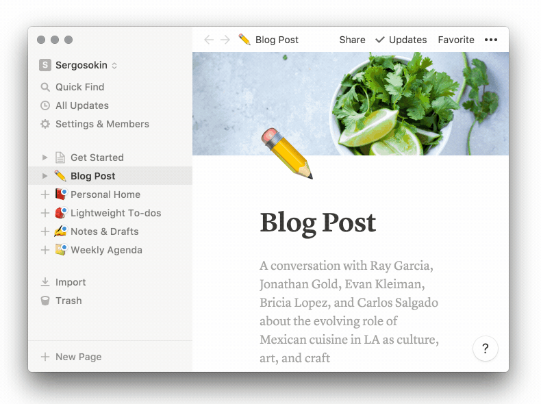
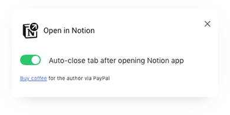

Open in Notion - Chrome Extension
======================

  

### This Chrome extension intercepts Notion pages links and redirects them to the [Notion desktop app](https://www.notion.so/desktop).   

## Preview

   

### Install
1. Download and install [Notion desktop app](https://www.notion.so/desktop).
2. [Install extension](https://chrome.google.com/webstore/detail/open-in-notion/kjemindnkfgkkfdekkinfamjahhlemca) from Chrome Web Store.

### How to Manually Install
1. Launch Chrome
2. Go to Extensions (`chrome://extensions/`)
3. Toggle `Developer mode`
4. Click `Load unpacked extension`
5. Select `src` folder from this repository

### Usage
1. Paste a Notion link into a Chrome address bar.
2. Press `Enter`.
3. If you see a confirmation dialog in Chrome, select "Always open these links associated with this app" option and then click "Open Notion" button.
4. If you need to open a pages link in Chrome tab instead of Notion desktop app, you can switch the extension off by clicking on the extension icon.

### Custom option
Right-clicking on the extension icon shows you preferences popup.   

### Donate (optional)
If you find this extension helpful, consider shouting me coffee ☕️ via [PayPal] or [Yandex Money] 🙂  

[PayPal]: https://paypal.me/osokin/2usd
[Yandex Money]: https://money.yandex.ru/to/410011149615582
  

### Contribute

Found a bug? Please submit a new issues on GitHub.